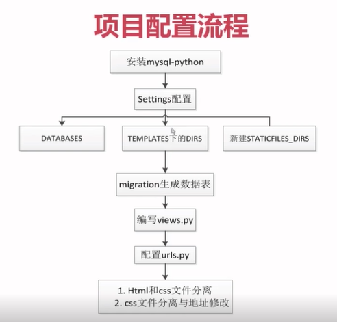

# 3.0 留言板项目配置



## Steps

1. 将html文件放入templates中
2. 在static创建css文件夹用于放置css文件
3. 在html文件加入

```html
<link rel="stylesheet" href="/static/css/style.css"
```
4. 配置数据库 (`settings.py`)

  1. sqlite改为mysql
  2. 加入名称用户名密码等 
  
```
'NAME': "testdjango",
'USER': "root",
'PASSWORDF': "root",
'HOST': "127.0.0.1"
```
  3. Errror Message: No module named MySQLdb
  因为还没有装mysql驱动
  [下载MySQL-python (python 2.7)
  下载Mysqlclient (python 3.5)](https://www.lfd.uci.edu/~gohlke/pythonlibs/)
  进入directory使用pip安装驱动
  4. Tools>Run manage.py task
  5. 生成默认数据表
  
  ``` 
  makemigrations (creating new migrations)
  migrate (applying migrations)
  ```
  6. Run>Debug>[name] 运行项目
  7. 配置view
  
  ```python
  def getform(request):
    return render(request, 'message_form.html')
    # rename form to message_form 
  ```
  9. 配置URL 
  
  ```python
  from message.views import getform
  
  url(r'^form/$', getform)
  ```
  10. 找不到template：修改 `settings.py` templates目录
  
  ```python
  'DIRS': [os.path.join(BASE_DIR, 'template')]
  ```
  11. 找不到style.css：配置STATICFILES_DIRS
  
  ```python
  STATICFILES_DIR = [
    os.path.join(BASE_DIR, 'static')
  ]
  ```
  